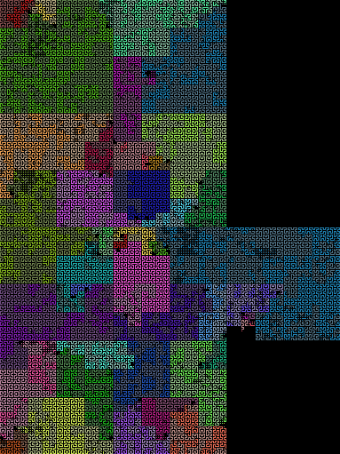
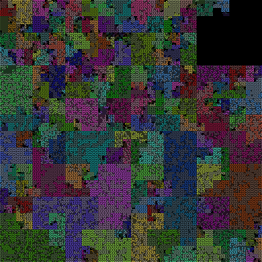
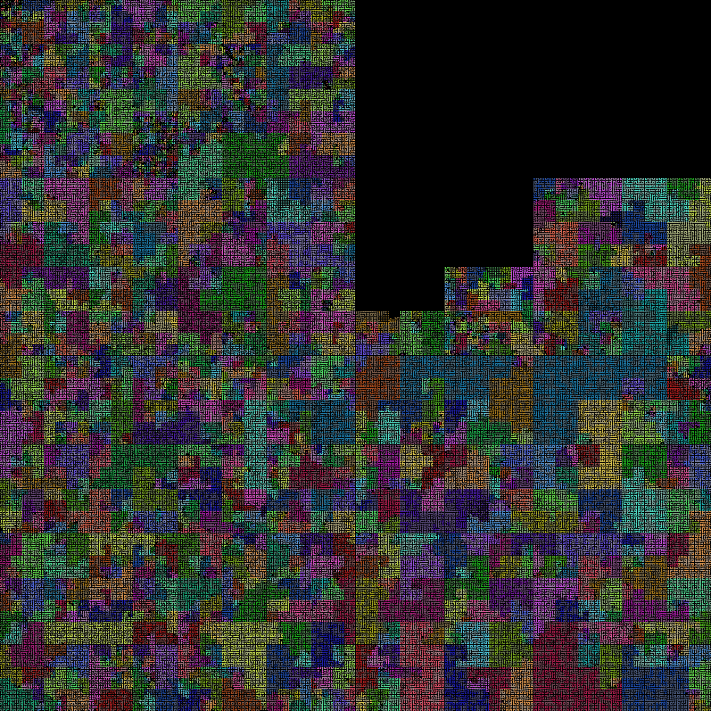

# Source Code Comparisons

## Databases

Redis is a small, fast, special-purpose database. SQLite is similar,
with a standard SQL front end.  MySQL and Postgres are both large,
very mature database servers. How big are these very different
codebases?

Redis is probably smaller than MySQL/Postgres, but how do the latter
two compare? SQL is tricky to parse, so SQLite is probably in between
Redis and MySQL/Postgres.

```
$ ./manage.py show sqlite redis mysql-5.5 postgresql-9.3
project              symbols   max  avg    total
sqlite                 1,780   810   19   35,522
redis                  3,850   417   16   62,503
mysql-5.5             12,664  1418   23  299,741
postgresql-9.3        29,078 22561   25  742,766
```

Redis is unsurprisingly small, at 63 KLOC.  Oddly, MySQL is less than
half the size of Postgres.

SQLite is _half_ the size of Redis, despite needing to parse complex
SQL statements. Startling.


## SQLite - 36 KLOC, 2K symbols

## Redis - 63 KLOC, 4K symbols


## Web frameworks

Flask is a minimal web framework, facilitating the use of plugins to
accomplish work.  Django is a mature "batteries included"
framework. How do they compare in terms of size and complexity? Also
examined are alternative Python web frameworks Bottle and Pyramid.

```
$ ./manage.py show flask bottle pyramid django-1.9
project              symbols   max  avg    total
flask                    463   196    9    4,208
bottle                 1,059    92    5    5,999
pyramid                1,933   462    7   15,174
django-1.9             7,208   263    8   58,988
```


## Single codebase over time

Projects change over time.  Does Django change by importing projects?
Or do people change little bits of code all over? If a project imports
others, we'd see big blocks of new color in the renderings. If
programmers did lots of fixes all over the codebase, we'd see lots of
little changes.

The following shows each minor release of Django, from 1.0 in 2008 to
1.10 in 2016.

```
project              symbols   max  avg    total
django-1.0             3,734   192    7   29,762
django-1.1             4,073   201    8   32,976
django-1.2             4,393   210    7   34,778
django-1.3             5,187   211    7   40,443
django-1.4             5,652   211    7   44,448
django-1.5             5,698   326    8   45,939
django-1.6             6,100   335    7   48,612
django-1.7             6,839   253    8   56,714
django-1.8             7,152   263    8   58,605
django-1.9             7,208   263    8   58,988
django-1.10            7,323   266    8   59,900
```





## Another codebase across major releases

Here is Python 2.7 vs Python 3.4:

```
./manage.py show python2 python3
project              symbols   max  avg    total
python2               75,532  2151   10  777,519
python3               80,643  2137   10  817,999
```

Python is surprisingly large, eclipsing even Postgres. Python 3.4 is
the largest codebase thus studied.





# Features

## Tags mode

In "tags mode", a source tree is colored per tag, or directory.  Since
Flask has only one directory, it's not that interesting. Image on the
left is rendered with one color per directory, on the right with one
color per file.


vs


Django has lots of directories, so tags mode makes the different areas
show more clearly. Compare per-directory


vs per-file


