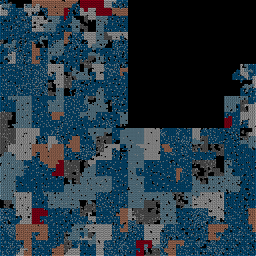

# Experimental Renderings

## Django code complexity

Each function is scored according to its code complexity. ([McCabe basis path testing](https://en.wikipedia.org/wiki/Cyclomatic_complexity); roughly the number of `if`s in the code.)

More-complex functions are drawn in red, less complex in blue, and medium-complex in white. Unknown complexity is in gray. This rendering shows the Django codebase is great, with most code being simple and clear.  

There are a few complex outliers. One is the `get_render` function, which scored D (from an A-E scale). Looking at the code shows the McCabe number has some utility: the function is huge (125 lines), with tons of `if`s and exception handlers.  https://github.com/django/django/blob/1.6/django/core/handlers/base.py#L76

Lastly, the start of each function is noted in two white pixels, giving this rendering a rather fetching "grains of rice" effect.

## Django paths, bounding box

## Django paths, with symbols

