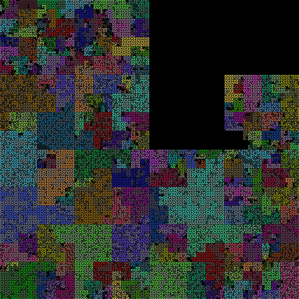

# INSTALL

```
    sudo apt install -y exuberant-ctags python-dev python-virtualenv
    virtualenv ./venv
    . ./venv/bin/activate
    pip install -r ./requirements.txt
    cd ./shotglass
    ./manage.py migrate
```


# DEMO: Flask, a small project

Shotglass displays information about all source files in a large
project. For each file, it renders a single dot per line of code. If
code has a symbol definition, ...

Overall workflow:

- get source tree
- store symbols in database index for quick processing

```
    $ apt source python-flask
    $ mv flask-0.10.1 flask
    $ ./manage.py make_index flask

    $ ./manage.py show flask
    project              symbols   max  avg    total
    flask                    463   196    9    4,208

    $ ./manage.py render flask
    $ firefox flask_path.png
```


# DEMO: Django, a bit larger

```
    $ apt source python-django

    $ ./manage.py make_index django
    2016-05-21 19:01:46,708 DEBUG    finding source
    2016-05-21 19:01:46,791 DEBUG    finding tags
    2016-05-21 19:01:49,622 INFO     django: 6,049 tags
    2016-05-21 19:01:49,622 DEBUG    calculating file sizes
    2016-05-21 19:01:53,366 DEBUG    done

    $ ./manage.py show django
    project              symbols   max  avg    total
    django                 6,049   335    7   48,326

    $ ./manage.py render django
```



# Code over Time

An important consideration is analyzing how code changes over time. For each release, how has the code changed? Many small patches implies code fixes. If a new big feature was merged in it will appear as a big spike in one file, with smaller patches in other files.  A security release will have a couple patches in a couple files.

Here are the changes for manpages in the "iproute2" (aka "ip", the successor to "route").  A few things to note:

- each release notes how many total changes there were
- there's one char per manpage, showing num of patches
- space = no changes, "." = 1-9 changes, -=10-99, +=100+, *=1000+

For this specific project, iproute2:

- v3.2 brought substantial changes to 8 manpages
- the next release modifies those exact 8 manpages a bit
- 3.8 and 3.10 have many small changes, mostly grammatical
- 4.0, as befitting a major release, makes minor tweaks to nearly every manpage. Examination shows minor changes (changing from two to one space after a sentence), and a number of additions.
- 3.5.1 and 3.14.1 have very few changes, and none on the manpages. These were probably important bugfix/security releases. This makes sense considering these two are the only "point" (x.y.Z) versions.
- 3.2 has a rare 2,700 line change, shown here with "*".  Looking it more closesly shows the ip.8 manpage was split into many sub-manpages, like ip-link.8 and ip-route.8.  ("git diff --stat v3.1.0..v3.2.0 man/man8")
- there's a vertical line of small changes in the 10th file.  This makes sense, as it's the "ip-link.8.in" file, which has references to all the other manpages.
```
57 manpages
v3.1.0 :  15     +                                        -        + .
v3.2.0 :  73            -    ---+ -+ +  ++*                 +    +   .
v3.3.0 :  60     .  .   .    .... .. .  ..-                 -   - +   
v3.4.0 :  61 --    -  .+   ++       +     . ..  .    -       .        
v3.5.0 :  43      .. +                            .   +. +  .  .     +
v3.5.1 :   4       .                                                  
v3.6.0 :  45       - -      -       -     -      .   . .+            +
v3.7.0 :  52     . .       --     .   +   .                           
v3.8.0 : 131 - .-+ .--  -   ----.-- ..  - -             .            .
v3.9.0 :  55        .+ .   -.           .+-        ..   ..          --
v3.10.0:  52       . -      --  - - -- ----.     .      -          -  
v3.11.0:  36                -       -                                 
v3.12.0:  41         -      +        -  .  .  -                       
v3.14.0:  81       .        -   -                -         +  +      .
v3.14.1:   1                                                          
v3.15.0:  46         -      -                                  .    - 
v3.16.0:  30                -          -                              
v3.17.0:  50                -                                         
v3.18.0:  83             -. - -   .      ..                           
v3.19.0:  56         - -    -     - -     -      -                   -
v4.0.0 :  79       ..- -.  .+.... - --  . -    . . ....- .. . . .-. .-
```


# [MORE DEMOS](DEMOS.md)

# [EXPERIMENTS](EXPERIMENTS.md)
