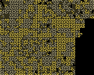

# INSTALL

```
    sudo apt install -y exuberant-ctags python-dev python-virtualenv
    virtualenv ./venv
    . ./venv/bin/activate
    pip install -r ./requirements.txt
    cd ./shotglass
    ./manage.py migrate
```


# DEMO: Flask, a small project

Shotglass displays information about all source files in a large
project. For each file, it renders a single dot per line of code. If
code has a symbol definition, ...

Overall workflow:

- get source tree
- rename raw source directory to a short project name
- store symbols in database index for quick processing

```
    $ apt source python-flask
    $ mv flask-0.10.1 flask
    $ ./manage.py make_index flask

    $ ./manage.py show flask
    project              symbols   max  avg    total
    flask                    463   196    9    4,208

    $ ./manage.py render flask
    $ firefox flask_path.png
```


# DEMO: Django, a bit larger

``` shell
    $ apt source python-django

    $ ./manage.py make_index django
    2016-05-21 19:01:46,708 DEBUG    finding source
    2016-05-21 19:01:46,791 DEBUG    finding tags
    2016-05-21 19:01:49,622 INFO     django: 6,049 tags
    2016-05-21 19:01:49,622 DEBUG    calculating file sizes
    2016-05-21 19:01:53,366 DEBUG    done

    $ ./manage.py show django
    project              symbols   max  avg    total
    django                 6,049   335    7   48,326

    $ ./manage.py render django
```


# MORE DEMOS

## Tags mode

In "tags mode", a source tree is colored per tag, or directory.  Since
Flask has only one directory, it's not that interesting:


