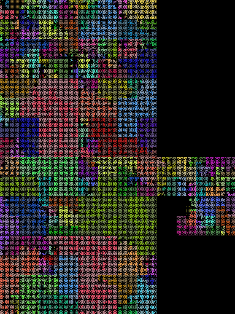
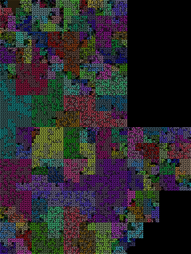
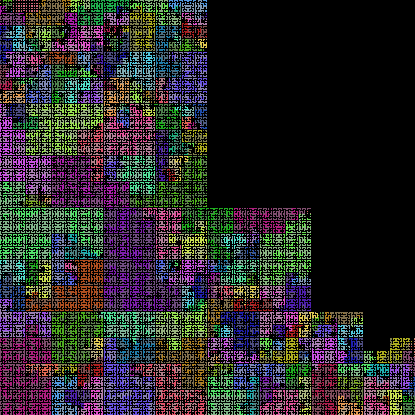
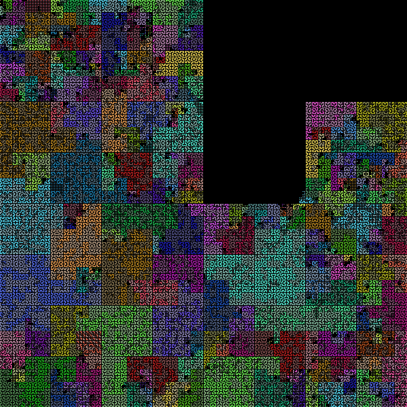
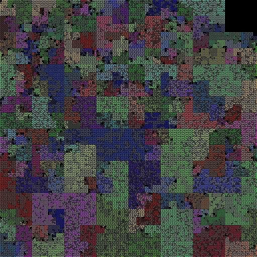
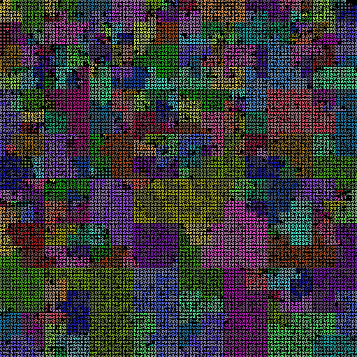
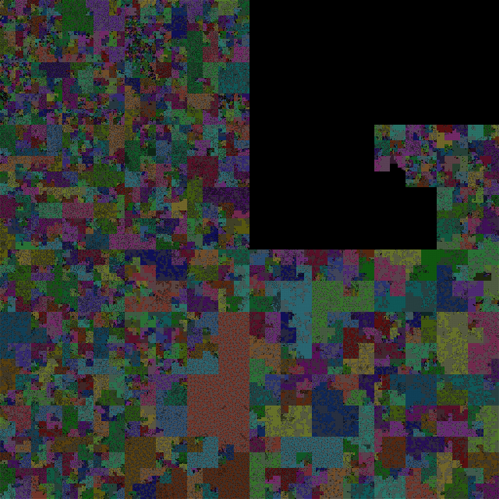

# Single codebase over time

## Django: 2008 - 2016, 30 - 60 KLOC

Projects change over time.  Does Django change by importing projects?
Or do people change little bits of code all over? If a project imports
others, we'd see big blocks of new color in the renderings. If
programmers did lots of fixes all over the codebase, we'd see lots of
little changes.

The following shows each minor release of Django, from 1.0 in 2008 to
1.10 in 2016.

```
project              symbols   max  avg    total
django-1.0             3,734   192    7   29,762
django-1.1             4,073   201    8   32,976
django-1.2             4,393   210    7   34,778
django-1.3             5,187   211    7   40,443
django-1.4             5,652   211    7   44,448
django-1.5             5,698   326    8   45,939
django-1.6             6,100   335    7   48,612
django-1.7             6,839   253    8   56,714
django-1.8             7,152   263    8   58,605
django-1.9             7,208   263    8   58,988
django-1.10            7,323   266    8   59,900
```














## Python language: 2.7 - 3.4, 780 - 820 KLOC

Here is Python 2.7 vs Python 3.4:

```
./manage.py show python2 python3
project              symbols   max  avg    total
python2               75,532  2151   10  777,519
python3               80,643  2137   10  817,999
```

Python is surprisingly large, eclipsing even Postgres. Python 3.4 is
the largest codebase thus studied.

### Python 2.7 - 780 KLOC, 76K symbols

### Python 3 - 820 KLOC, 81K symbols


