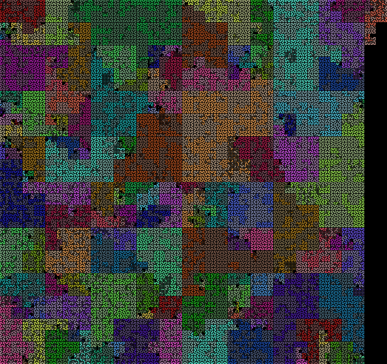

# Databases from 1x to 20x

Redis is a small, fast, special-purpose database. SQLite is similar,
with a standard SQL front end.  MySQL and Postgres are both large,
very mature database servers. How big are these very different
codebases?

Redis is probably smaller than MySQL/Postgres, but how do the latter
two compare? SQL is tricky to parse, so SQLite is probably in between
Redis and MySQL/Postgres.

```
$ ./manage.py show sqlite redis mysql-5.5 postgresql-9.3
project              symbols   max  avg    total
sqlite                 1,780   810   19   35,522
redis                  3,850   417   16   62,503
mysql-5.5             12,664  1418   23  299,741
postgresql-9.3        29,078 22561   25  742,766
```

Redis is unsurprisingly small, at 63 KLOC.  Oddly, MySQL is less than
half the size of Postgres.

SQLite is _half_ the size of Redis, despite needing to parse complex
SQL statements. Startling.


### SQLite - 36 KLOC, 2K symbols

### Redis - 63 KLOC, 4K symbols

### MySQL - 300 KLOC, 13K symbols

### PostgreSQL - 743 KLOC, 30K symbols

