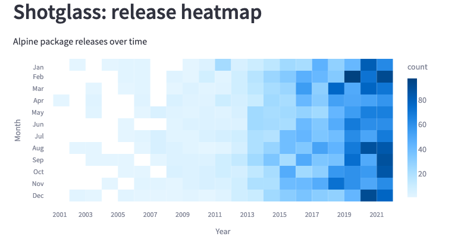

# Shotglass x Streamlit 

Various Shotglass demos using Streamlit framework.

Shows package and code from Alpine Linux distribution.

## TLDR

For any "app.py", run the Streamlit app by typing `make app.run`

Example, for demo_alt_isotype_emoji.py:

    make demo_alt_isotype_emoji.run

Open browser to the Streamlit instance, http://localhost:8501/

## Shotglass apps

<dl>
<dt>releases_heatmap.py</dt>
<dd>heatmap of Alpine packages releases over time

TODO: plot average releases _per package_ vs total for all packages

</dd>
<dt>releases_strip.py</dt>
<dd>Releases over time, rendered as strips.

</dd>
</dl>

## List of Demos

"Alt" = uses Altair-Vega plotting library.

    demo_alt_heatmap.py
    demo_alt_isotype.py
    demo_alt_isotype_emoji.py
    demo_altair.py
    demo_shotglass_stats.py
    demo_uber.py

