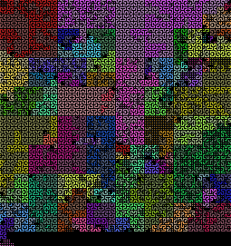

# Web frameworks

Flask is a minimal web framework, facilitating the use of plugins to
accomplish work.  Django is a mature "batteries included"
framework. How do they compare in terms of size and complexity? Also
examined are alternative Python web frameworks Bottle and Pyramid.

```
$ ./manage.py show flask bottle pyramid django-1.9
project              symbols   max  avg    total
flask                    463   196    9    4,208
bottle                 1,059    92    5    5,999
pyramid                1,933   462    7   15,174
django-1.9             7,208   263    8   58,988
```

### Flask - 4 KLOC, 0.5 K symbols

### Bottle - 6 KLOC, 1K symbols

### Pyramid - 15 KLOC, 2K symbols

### Django - 60 KLOC, 7K symbols


